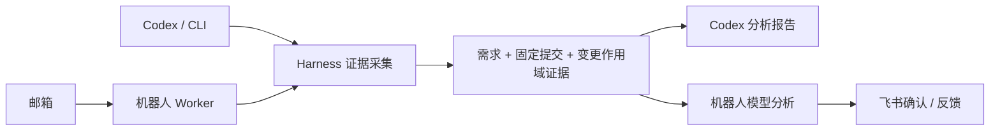

# 代码变更分析

项目分为独立 Harness 和机器人两部分。Harness 维护唯一的需求和代码变更证据实现；机器人复用它，再完成任务调度、模型分析和飞书交互。

| 部分 | 位置 | 职责 |
|---|---|---|
| Harness | [change-analysis-harness](change-analysis-harness/README.md) | TAPD/钉钉需求、固定 Git 提交、diff、变更作用域 AST、定向引用候选、证据报告 |
| 机器人 | [orchestrator](orchestrator/README.md) | 邮箱触发、任务队列、模型分析、飞书通知、确认和反馈 |
| 钉钉桥接 | [dingtalk_doc_bridge](dingtalk_doc_bridge/README.md) | 连接钉钉文档 MCP 网关，按需独立启动，两边共用 |
| 历史 Skill | [analyze-change-test-scope](analyze-change-test-scope/README.md) | 旧名称和脚本兼容，转发到 Harness |



## 只使用 Harness

需要 Python 3.11+ 和 Git。在仓库根目录运行：

```powershell
python -m pip install -e ./change-analysis-harness
Copy-Item change-analysis-harness/.env.example change-analysis-harness/.env
python -m change_analysis_harness `
  "https://www.tapd.cn/123/stories/view/456" "feature/example" `
  --repo D:/src/project --base-branch master `
  --env-file change-analysis-harness/.env `
  --output .local/change-analysis.json --reporter-dir reporter
```

Harness 不需要机器人、RabbitMQ 或模型 API。返回 `READY_FOR_CODEX`、`analysis_input` 和证据，`analysis` 为 `null`。自动生成的 Markdown 是证据报告，最终业务结论和测试点仍需 Codex 分析。

`analysis_input` 额外包含确定性 `selection_plan`、`impact_units` 与 `effort`（`ANALYSIS_EFFORT` / `--effort`）。可用 `--preview` 只查看门禁表与 ImpactUnit 分组。机器人按 `impact_units` 分批（无则回退字节切分），默认串行，可用 `LLM_UNIT_CONCURRENCY` 开启有界并发；分析返回后会跑 CoverageReflector，把缺口写入 `uncertainties`。

仅获取需求可运行 `python -m change_analysis_harness.requirement_cli --help` 查看参数。

## 使用机器人

```powershell
python -m pip install -r requirements.txt
Copy-Item .env.example .env
Copy-Item .local/projects.example.json .local/projects.json
Copy-Item .local/reviewers.example.json .local/reviewers.json
```

填写配置后，按[机器人运行说明](orchestrator/README.md)启动。机器人使用根目录 `.env`；Harness CLI 通过 `--env-file` 显式选择配置。已有配置文件时直接编辑，不要覆盖。

## 一致性的范围

两条路径共用需求读取、Git 快照、变更行和 Java AST、证据裁剪与降级规则，以及[影响分析指南](change-analysis-harness/src/change_analysis_harness/guidance/impact-and-test-guide.md)和[报告覆盖项](change-analysis-harness/src/change_analysis_harness/guidance/report-template.md)。变更这些规则只需修改 Harness。

机器人额外支持多仓库任务、模型分批分析和飞书反馈；Codex 与机器人使用不同执行环境和报告格式，因此保证采集实现与分析规则一致，不保证模型生成的文字逐字相同。候选引用仍需源码确认，缺失证据必须明确列为待确认。

旧命令 `python -m orchestrator.change_analysis_harness` 保留，但已与新 CLI 完全一致：不会再调用模型，也不再接受 Python 构造参数 `llm_service`。自动分析请使用机器人 Worker。

根目录的 `agent_sdk_connect.py`、`agent_sdk_skill_test.py`、`llm_connect.py` 是历史连通性或 Skill 工具实验，不属于两条正式运行路径；尤其 Skill 实验中的独立裁剪和执行方式不作为 Harness 功能一致性的保证。

## 验证

```powershell
python -m unittest discover -s tests
python -m unittest discover -s change-analysis-harness/tests
python -m unittest discover -s analyze-change-test-scope/tests
```

`tests/test_harness_bot_parity.py` 使用临时 Git 仓库验证两条路径的证据一致，并检查 Harness 入口不加载机器人和模型依赖。测试不会发送飞书消息或调用真实模型。
